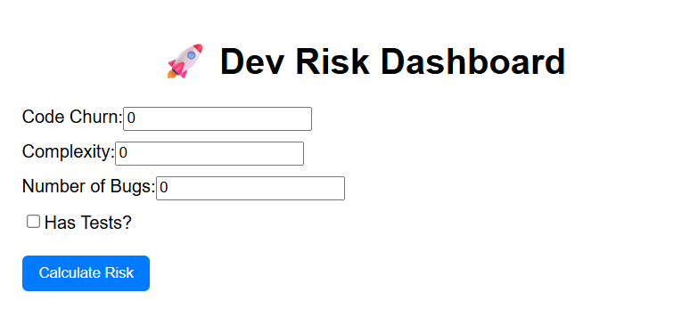
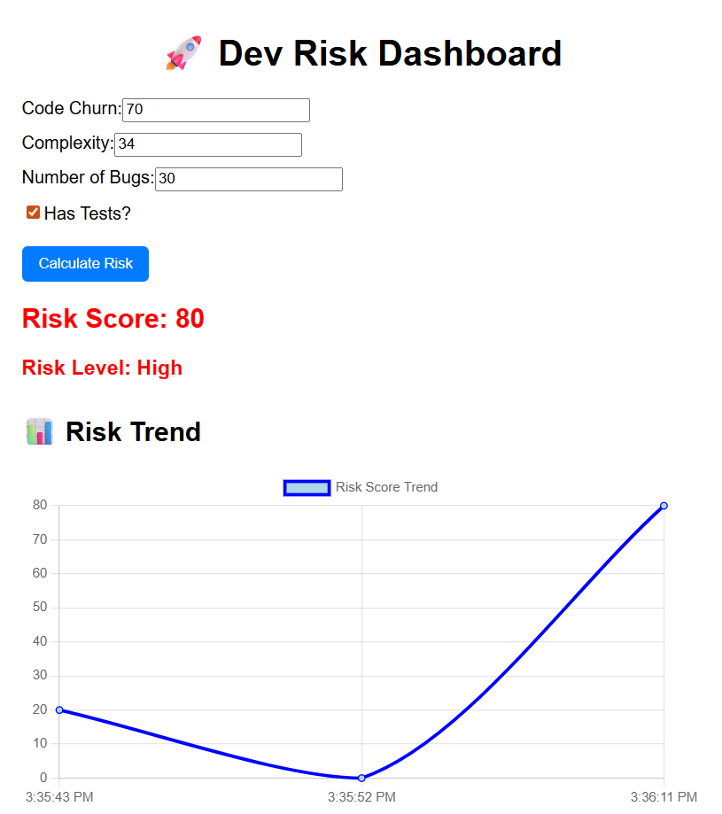

# 🚀 Dev Risk Dashboard

A full-stack DevOps Risk Monitoring Dashboard that evaluates deployment risk based on software engineering metrics such as code churn, complexity, bug count, and test coverage.

This project simulates how DevOps teams assess release stability before deployment.

---

## 📌 Project Overview

The Dev Risk Dashboard calculates a weighted risk score using multiple quality indicators and classifies it into:

- 🟢 Low Risk  
- 🟠 Medium Risk  
- 🔴 High Risk  

It also maintains historical tracking and visualizes risk trends using interactive charts.
---

## 📸 Screenshots

### Dashboard Interface


---

### Risk Calculation & Trend Visualization


---

---

## 🧠 Risk Calculation Logic

Risk score is calculated based on the following rules:

- Code Churn > 50 → +30
- Complexity > 7 → +30
- Bugs > 5 → +20
- No Test Coverage → +20

The system includes backend validation to prevent invalid inputs such as negative values.

---

## 🛠 Tech Stack

### Frontend
- React.js
- Chart.js (Data Visualization)
- Fetch API

### Backend
- Node.js
- Express.js
- CORS

### Version Control
- Git
- GitHub

---

## ✨ Features

- ✅ Risk scoring engine
- ✅ Risk classification (Low / Medium / High)
- ✅ Backend validation
- ✅ Error handling
- ✅ Historical risk tracking
- ✅ Risk trend visualization (Line Chart)
- ✅ Clean and structured dashboard layout

---

## 📊 How It Works

1. User enters project metrics.
2. Frontend sends data to backend via POST request.
3. Backend validates inputs.
4. Risk score is calculated.
5. Result is returned and displayed.
6. History is stored in React state.
7. Risk trend is visualized using Chart.js.

---


## ⚙️ Environment Configuration

Create `client/.env` (or `client/.env.local`) to configure backend URL:

```bash
REACT_APP_API_BASE_URL=http://localhost:5000
```

If not provided, the app defaults to `http://localhost:5000`.

## 🖥️ How To Run Locally

### 1️⃣ Clone the repository

```bash
git clone https://github.com/VishalPandey1329/dev-risk-dashboard.git
cd dev-risk-dashboard
```

### 2️⃣ Install dependencies

```bash
npm install
cd client
npm install
cd ..
```

### 3️⃣ Start backend (Terminal 1)

```bash
npm start
```

Backend runs on `http://localhost:5000`.

### 4️⃣ Start frontend (Terminal 2)

```bash
cd client
npm start
```

Frontend runs on `http://localhost:3000`.

### 5️⃣ Run tests/checks

```bash
# Frontend tests
cd client
CI=true npm test -- --watchAll=false

# Basic JS syntax checks (backend + frontend)
cd ..
node --check server.js
node --check client/src/App.js
node --check client/src/App.test.js
```

---

## 🚀 Future Improvements

- Persistent database storage (MongoDB)
- Authentication system
- Cloud deployment
- CI/CD integration
- Customizable risk weight configuration

## 🎯 Learning Outcomes

Through this project, I gained hands-on experience in:

- Full-stack development
- REST API design
- React state management
- Backend validation practices
- Data visualization
- Git workflow and repository management

## 👨‍💻 Author

Vishal Pandey  
GitHub: https://github.com/VishalPandey1329

⭐ If you found this project interesting, feel free to star the repository!
